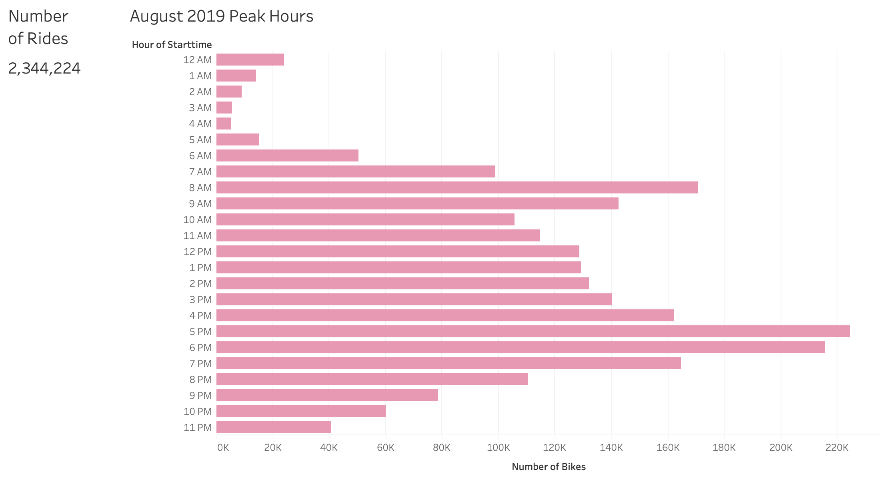
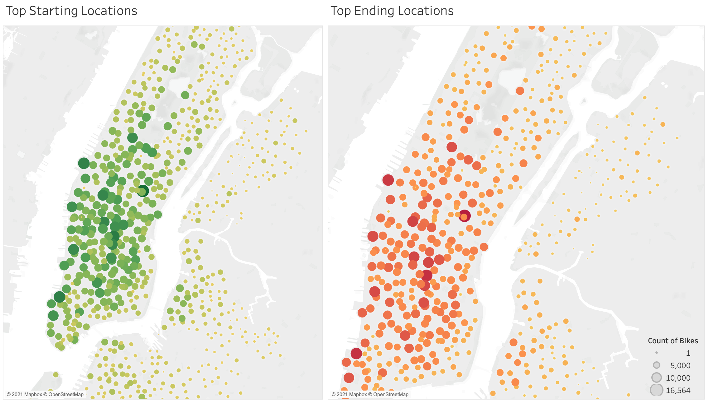
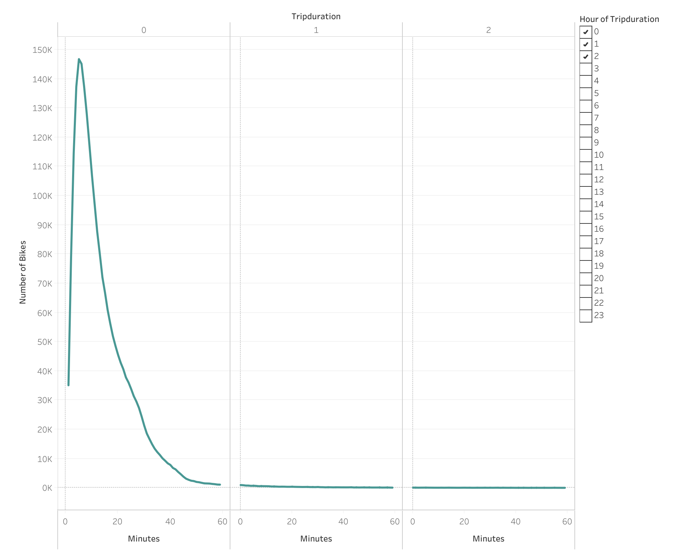
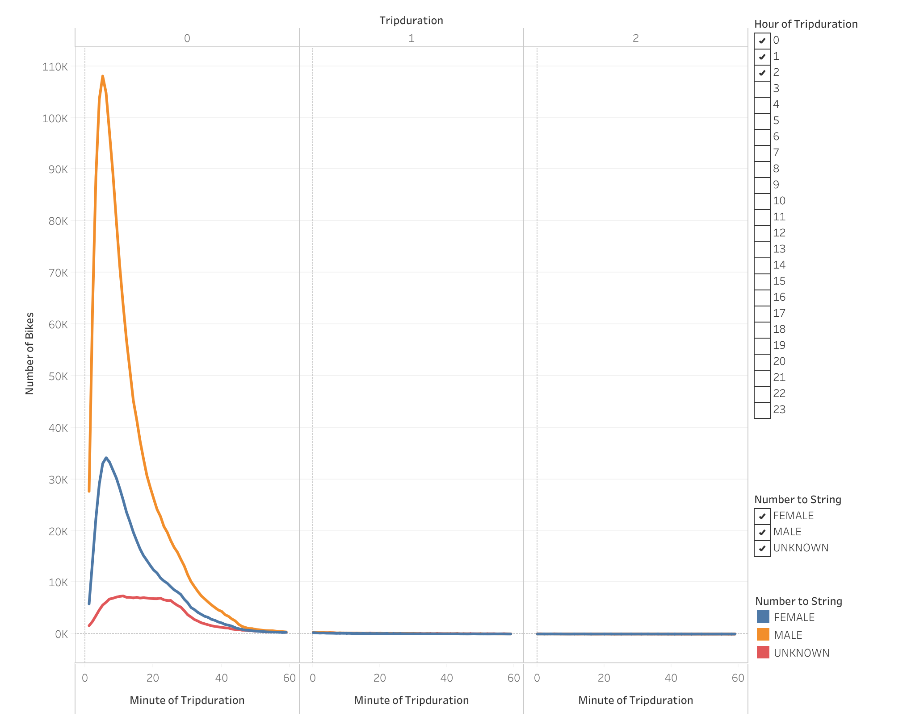
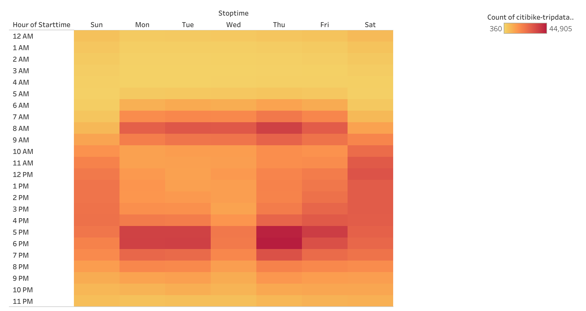
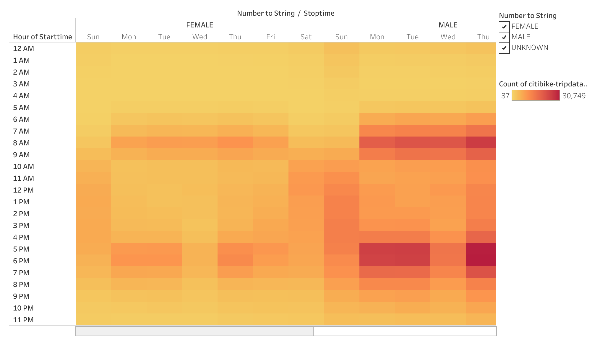
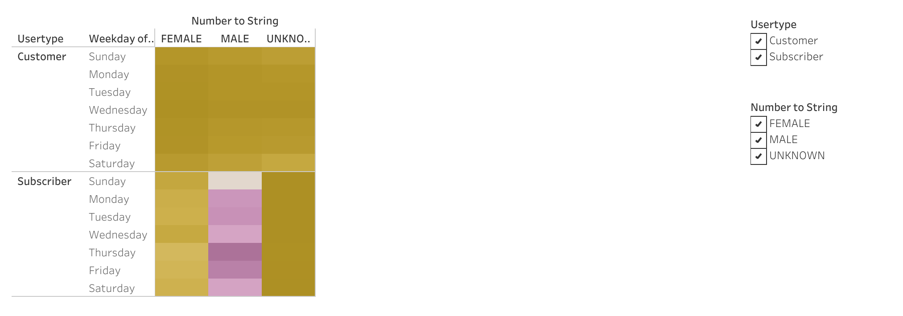

# NYC Citibike Analysis

# Overview
This analysis was created to provide visualizations and insight into New York's bike program and to see if this program can be recreated in Des Moines, Iowa. Data for this analysis was created using data from August 2019.

The purpose of this analysis was to not only see if this program can be done in Iowa, but also to answer the following questions:
* How long bikes are checked out for all riders and genders.
* How many trips are taken by the hour for each day of the week, for all riders and genders.
* A breakdown of what days of the week a user might be more likely to check out a bike, by type of user and gender.

# Results
Please note all visualizations are also published on Tableau Public, the link can be found [here](https://public.tableau.com/app/profile/ekta4172/viz/nyc_citibike/NYCCitibikeAnalysis?publish=yes).

The below visualization shows an overview of NYC's Citibike in August 2019. The graph shows the highest count being between the commuting hours in the morning and evening times.

Below is a visualization of the locations of where the bikers are beginning and ending their trips. These maps reflect that highest ridership occurs in the middle of New York and in the lower part of New York.

Using the questions above as a guide, the following visualizations answer the questions.

### How long are bikes checked out by all riders and genders?

The two visualizations below show checkout times by, the total number of users and then by gender. Looking at the data by users, most riders prefer to hold onto a bike for a duration between five and fifteen minutes.

 When looking at the data by gender, the visualization shows that males are biking more than females; however the most common duration in which bikes are being used with each gender mirror the duration for overall ridership as well.

### How many trips are taken by the hour for each day of the week, for all riders and genders?

The following visualizations answer how many trips are taken during each hour of the day during the weekday. The visualization below looks at hourly ridership during the weekday, this visualization reflects that most of the the trips are taken during commuting hours of the day. Between 6 - 9 AM and 4 - 6 PM is when ridership is at the highest.

The below visualization shows trips taken by the hour for each weekday broken by gender. This analysis mirrors the analysis by weekday, where the highest ridership for both genders is between commuting hours. However, when comparing between both genders the males have significantly higher numbers for ridership than females.

### What days of the week is a user more likely to check out a bike, by type of user and gender?

Based on the analysis below, Thursdays are the best days for male subscribers are likely to check out a bike. 

# Summary

The best takeaway from the NYC Citibike analysis is that in order to build a successful sister bike program in Iowa, the following should be considered:
* Males should be the targetted demographic in Des Moines.
* Bikes for rental should be placed where the most people are located in Des Moines, similar to how in NYC it was mid and lower.
* Commuting hours are the best times when rentership will occur.

Additionally, in the future more analysis can be done to see how to further make the program successful:
* Breaking down the times when each location in NYC is more popular, and using user and gender analysis. This would on how to target the areas in Des Moines and see which times those areas would be better suited for the program.
* We can analyze using birth year to see which age demographics are using the programs. Adding age into the analysis will be to help the clients understand which demographic they should market the program to.
